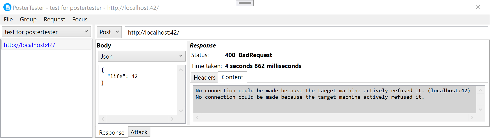
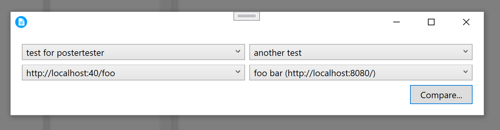
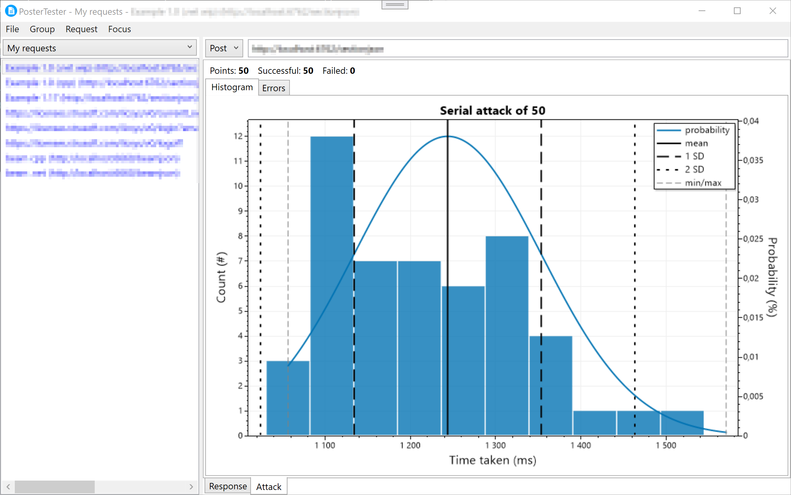
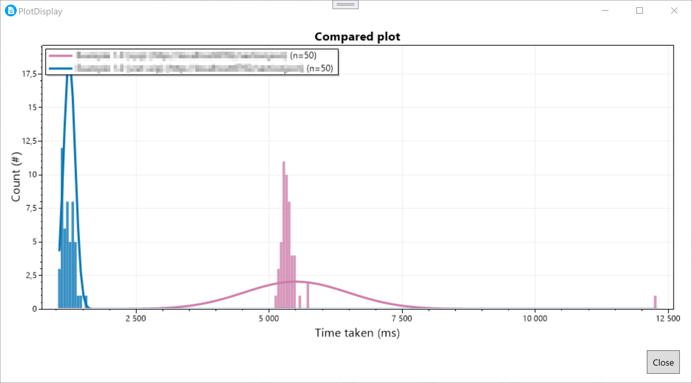

# PosterTester

Basic "postman" clone in .NET 8 in WPF (i.e windows only at the moment).

Warning: Still in development, stored data might be destroyed after a update

## Current features
* No external services or call-to-home. 
* Share requests by saving project files to a shared place (shared folder, git repo, etc)
* Compare the output of 2 different requests
* "Attack" a endpoint by "calling" it many times and plot the reponse times
* Commandline to run tests

## Screenshots

Main GUI showing groups, url, mehtod dropdown and failed response from localhost

Compare dialog

The response times plotted after calling the endpoint 50 times in a row

Compare the response time for 2 requests. Does two different endpoints roughly take the same time? Duplicate one request and test out some optimization? Your imagination is the limit!

## Code layout
| Project      | Usage                                 |
|--------------|---------------------------------------|
| PosterTester | Main WPF gui                          |
| PosterLib    | Library that does all the actual work |
| pstrtstr     | Commandline tool                      |

## Possible some time in the future (not necessarily in a specifc order)
* Group settings (url variables, shared login settings)
* Add function to move requests between groups
* Change groups list/dropdown to a tree view?
* Make the ui more pretty (port to avalonia)
* AOT port
* Make it cross platform
* Option to send compact json
* Ctrl-p to fuzzy match requests and groups
* Better progress indicator when doing attacks
* Ctrl-tab functionality to switch between recently used requests
* Use output from one request as input to another
* Script tests and input "wizards" with .net
* Solarized light + dark theme
* More features to the requests input (like timeout settings)
* Login options (auth0 etc...)
* Launch a diff between requests
* Duplicate all request data
